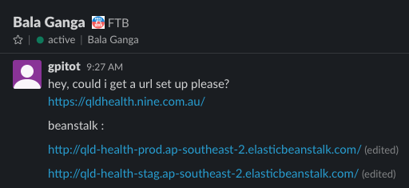

## INSTALLATION
* nvm use
* npm i

## RUNNING 
* npm start

## DEPLOYMENT
* push to master

## GOING LIVE
#### GETTING STUDIO PROJECTS
* clone this directory - https://stash.9msn.net/projects/CS/repos/studios-deployment/browse (not into your project!)
* edit deploy-config folder
* find the latest site that has gone live
* copy folder and rename to the name of your new project (this will match PROJECT_NAME in CI parameters)
* git add / commit / push

#### create CI pipeline
* go to http://ci.9msn.net/
* go to latest project we have made
* edit project settings
* actions - copy
* change name to Studios - "name"
* save

#### edit CI pipeline
* go to parameters on left
* edit PROJECT_NAME to same name as your config deployment folder
* edit REPO_NAME to same name as your stash repo
* note REPO_PATH is the alias of your repo folder like psw for powered-studios-website
* go to Project Home top right
* click preprod (DONT RUN YET!)
* go to edit configuration settings then parameters
* change deploy_strat to 'deploy:bluegreen' (no quotes)
* run build
* run staging and preprod
* once successfully complete rename preprod deploy_strat to deploy:newUniqueEnvironment
* run preprod again!
* run promote prod
* delete old prod (optional)

#### AWS

* go to AWS https://ninestudios.awsapps.com/console/#login:redirect_to=awsconsole
* search for elastic beanstalk
* get preview link from beanstalk page 
* contact dev ops about setting up url 

### ask ops team for url
